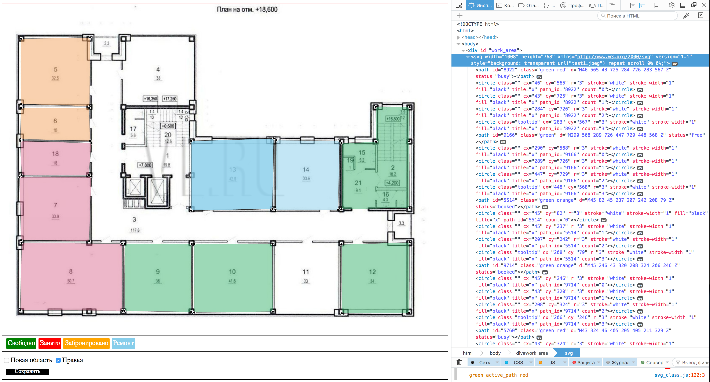

# Плоскость 4

##Описание
Выделение областей на изображении при помощи svg, js/jquery.

###Текущие возможности:
- добавление плоскости
- изменение координат узловых точек плоскости
- выделение плоскости цветом

###Необходимые возможности:
- удаление плоскости
- удаление последней узловой точки плоскости
- изменение координат плоскости (перетаскивание)
- ...

###Пример работы:

